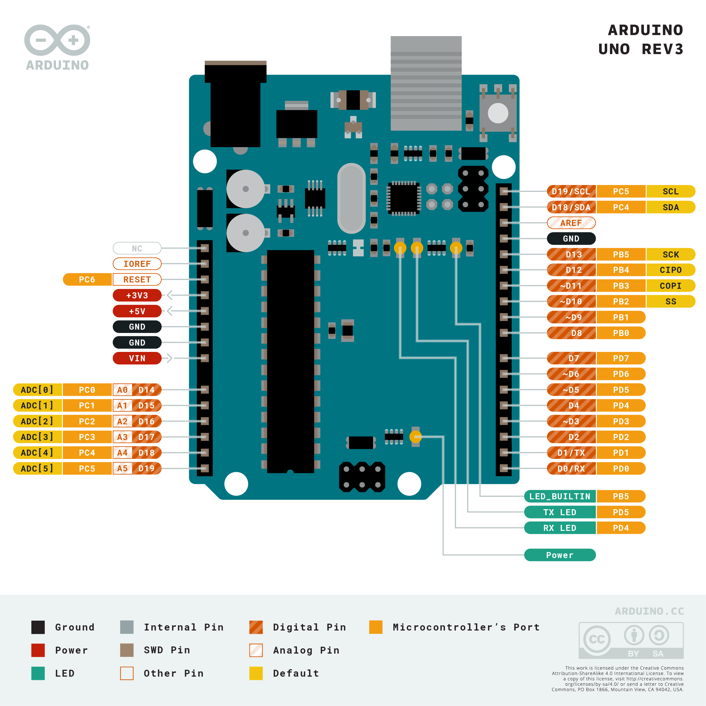
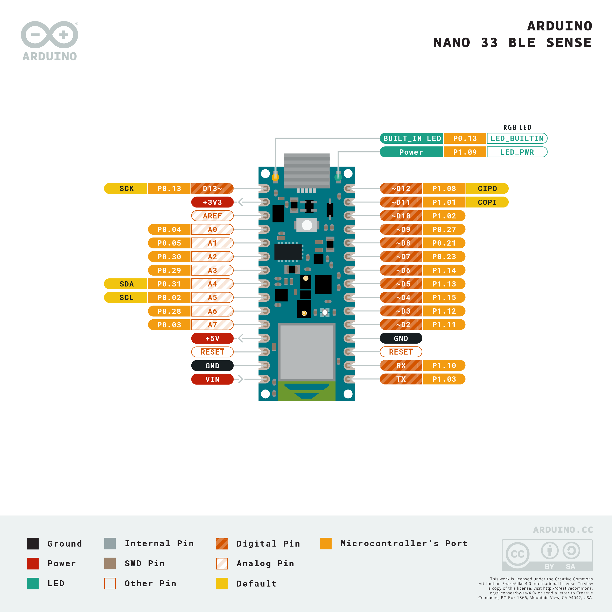

# Conosciamo la scheda

In laboratorio di informatica sono presenti delle schede `Arduino UNO` (grandi classici), ma in dotazione al laboratorio di fisica ci sono anche le schede `Arduino Nano 33 BLE Sense`.

## *Arduino UNO*

Questa scheda opera a 5v e non possiede nessun sensore integrato. È l'ideale per interfacciarsi con sensori esterni, in quanto spesso questi sono a 5v. La connessione di pin è più semplice rispetto ad un Nano, in quanto ci sono direttamente sulla scheda i fori in cui inserire i cavi (non serve una breadboard).

### Pinout

I pin PWM sono indicati con la tilde `~`.

### Su Arduino IDE

Arduino UNO non richiede alcun setup iniziale all'interno di Arduino IDE.

## *Arduino Nano 33 BLE Sense*

Alcune risorse comode per una rapida consultazione:
- [Arduino Store](https://store.arduino.cc/products/arduino-nano-33-ble-sense)
- [Descrizione hardware (con relativi datasheet)](https://docs.arduino.cc/hardware/nano-33-ble-sense)

Questa scheda opera a 3.3v, quindi attenzione a non far andare voltaggi maggiori nei pin. Se un sensore che volete connettere richiede 5v, potrebbe convenirvi usare un *Arduino UNO*. Parrebbe che questa scheda abbia talvolta problemi a connettersi ai computer, richiedendo di impostare ripetutamente la porta nelle impostazioni di Arduino IDE (l'UNO non ha questo problema invece).

### Pinout

- 13 pin digitali + 1 led sulla board (Tx, Rx, D2-D13)
  - D2-D13 sono in teoria tutti gestibili con il PWM, ma è meglio controllare, data l'imprecisione nella documentazione
- 8 entrate analogiche (A0-A7, 12 bit, 200 kHz)

### I sensori presenti sulla scheda

Questa scheda, a differenza dell'Arduino UNO, ha a bordo vari sensori:

- Accelerometro, Giroscopio, Bussola: LSM9DS1
- Microfono: MP34DT05
- Luce: APDS9960
- Pressione: LPS22HB
- Umidità: HTS221

### Installazione della scheda su Arduino IDE

Questa scheda richiede un'installazione all'interno di Arduino IDE prima che possano esserci caricati dei programmi. Bisogna andare in `Strumenti -> Scheda -> Gestore schede`, e poi installare il pacchetto chiamato *Arduino Mbed OS Nano Boards*.

## Collegamento al computer

- Collegare l'usb
- All'interno di Arduino IDE impostare la scheda e la porta a cui è connessa dal menù `Strumenti`
    - La scheda sarà o *Arduino Uno*, oppure *Arduino Nano 33 BLE*
- Per verificare se il programma è scritto correttamente si può usare il pulsante "Verifica", mentre per caricare un programma sulla scheda si preme sul pulsante "Carica"
    - Non è necessario premere "Verifica" prima di caricare
    - La scheda *Arduino Nano 33 BLE Sense* potrebbe disconnettersi dopo un caricamento, pertanto bisogna riconnettersi selezionando nuvamente la porta nel menù `Strumenti`