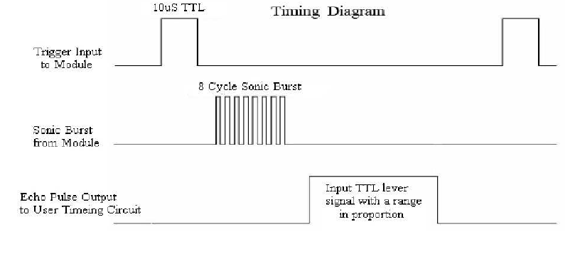

# Sensore ad ultrasuoni

### [Progetto di esempio: ultrasuoni](./ultrasuoni/ultrasuoni.ino)

- Il sensore ad ultrasuoni in dotazione della scuola è il HC-SR04.
- Opera a 5v, pertanto si può connettere solo ad un Arduino Uno (il Nano 33 BLE opera a 3.3v, quindi richiederebbe un convertitore 3.3v-5v).
- Invia segnali acustici a 40kHz

## PIN

- VCC va connesso alla 5v
- GND va connesso alla terra
- TRIG è il pin di innesco, e va connesso ad un pin digitale, su cui poi si farà `pinMode(.., OUTPUT)`
- ECHO è il pin di risposta, e va connesso ad un pin digitale, su cui poi si farà `pinMode(.., INPUT)`

## Tempi

Come spiegato all'interno del codice, il sensore opera così:
- aspetta di ricevere un impulso di 10 microsecondi sul pin TRIG
- emette un segnale acustico a 40kHz
- attiva il pin ECHO
- disattiva il pin ECHO non appena riceve un segnale acustico riflesso

Pertanto misurando il tempo in cui è stato acceso il pin ECHO si può ottenere il tempo trascorso da quando il suono è stato trasmesso a quando è stato ricevuto.

