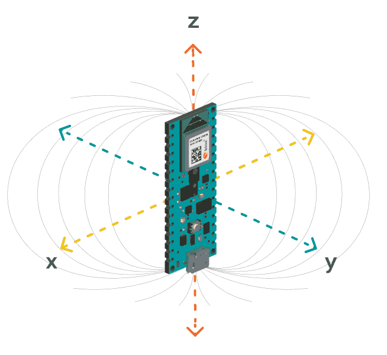

# LSM9DS1

- Il modulo inerziale LSM9DS1 è integrato nell'Arduino Nano 33 BLE Sense e pertanto si può usare solo con tale scheda.
- Il datasheet è accessibile [qui](./assets/LSM9DS1.pdf) (scaricato) o [qui](https://cdn.sparkfun.com/assets/learn_tutorials/3/7/3/LSM9DS1_Datasheet.pdf) (fonte originale).
- Per l'uso dei sensori su questa scheda è necessario installare la libreria omonima. Si può fare in due modi:
  - Il modo più comodo per perdere meno tempo con gli studenti in laboratorio è copiare i file [*Arduino_LSM9DS1.h*](./accelerometro/Arduino_LSM9DS1.h), [*LSM9DS1.h*](./accelerometro/LSM9DS1.h) e [*LSM9DS1.cpp*](./accelerometro/LSM9DS1.cpp) nella cartella del progetto, quella in cui è presente anche il file *.ino*. Poi il progetto sarà portabile a tutti i computer **senza ulteriore setup necessario**. I tre file sono già presenti nei tre progetti di esempio per accelerometro, giroscopio e magnetometro.
  - Altrimenti basta andare in `Strumenti -> Gestione librerie`, cercare "LSM9DS1" ed installare "Arduino_LSM9DS1". Bisognerà però ripetere questa azione su ogni computer su cui si vuole usare il progetto.
- Per interagire con la libreria all'interno del codice bisogna includerla con `#include "Arduino_LSM9DS1.h"`. La documentazione della libreria è disponibile [qui](https://www.arduino.cc/reference/en/libraries/arduino_lsm9ds1/).
- All'interno del `setup()`, per inizializzare la connessione con il modulo, si usa `IMU.begin()`.

## Magnetometro con calibrazione iniziale

### [Progetto di esempio: magnetometro_calibrazione](./magnetometro_calibrazione.ino)

- Fornisce misurazioni ad una frequenza di 20Hz.
- Riesce a leggere valori di campo magnetico da $-400\mu T$ a $+400\mu T$, con una precisione di $\pm 1.4 \cdot 10^{-2}\mu T$.
- Fornisce i dati nell'unità di misura $\mu T$, ovvero microTesla.

Il progetto in questa cartella fa una calibrazione iniziale del magnetometro, così da rimuovere il campo magnetico terrestre ed altre interferenze dalle misurazioni. È quindi una buona idea tenere il sensore fermo durante l'esecuzione del programma, così che i dati di calibrazione restino validi. Se non si vuole questo tipo di calibrazione iniziale, si puo' usare il progetto [magnetometro](../magnetometro/13_magnetometro.md) invece.

Più informazioni sul magnetometro sono disponibili [nel tutorial ufficiale di Arduino](https://docs.arduino.cc/tutorials/nano-33-ble-sense/imu-magnetometer).

