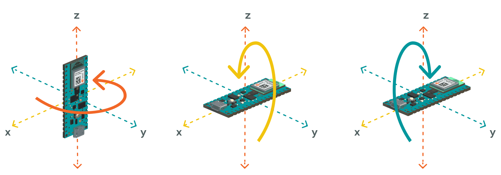

# LSM9DS1

- Il modulo inerziale LSM9DS1 è integrato nell'Arduino Nano 33 BLE Sense e pertanto si può usare solo con tale scheda.
- Il datasheet è accessibile [qui](./LSM9DS1.pdf) (scaricato) o [qui](https://cdn.sparkfun.com/assets/learn_tutorials/3/7/3/LSM9DS1_Datasheet.pdf) (fonte originale).
- Per l'uso dei sensori su questa scheda è necessario installare la libreria omonima. Si può fare in due modi:
  - Il modo più comodo per perdere meno tempo con gli studenti in laboratorio è copiare i file [*Arduino_LSM9DS1.h*](./Arduino_LSM9DS1.h), [*LSM9DS1.h*](./LSM9DS1.h) e [*LSM9DS1.cpp*](./LSM9DS1.cpp) nella cartella del progetto, quella in cui è presente anche il file *.ino*. Poi il progetto sarà portabile a tutti i computer **senza ulteriore setup necessario**. I tre file sono già presenti nei progetti di esempio per accelerometro, giroscopio e magnetometro, quindi basta copiare le relative cartelle e modificarle.
  - Altrimenti basta andare in `Strumenti -> Gestione librerie`, cercare "LSM9DS1" ed installare "Arduino_LSM9DS1". Bisognerà però ripetere questa azione su ogni computer su cui si vuole usare il progetto.
- Per interagire con la libreria all'interno del codice bisogna includerla con `#include "Arduino_LSM9DS1.h"`. La documentazione della libreria è disponibile [qui](https://www.arduino.cc/reference/en/libraries/arduino_lsm9ds1/).
- All'interno del `setup()`, per inizializzare la connessione con il modulo, si usa `IMU.begin()`.


## Giroscopio

### [Progetto di esempio: giroscopio](./giroscopio.ino)
```C++
{{#include giroscopio.ino}}
```
- Fornisce misurazioni ad una frequenza di 104Hz.
- Riesce a leggere velocità angolari da \\( -2000°/s \\) a \\( +2000°/s \\), con una precisione di \\( \pm 7 \cdot 10^{-2}°/s \\).
- Fornisce i dati nell'unità di misura \\( dps \\), ovvero \\( °/s \\), ovvero gradi al secondo.

Più informazioni sul giroscopio sono disponibili [nel tutorial ufficiale di Arduino](https://docs.arduino.cc/tutorials/nano-33-ble-sense/imu-gyroscope).


