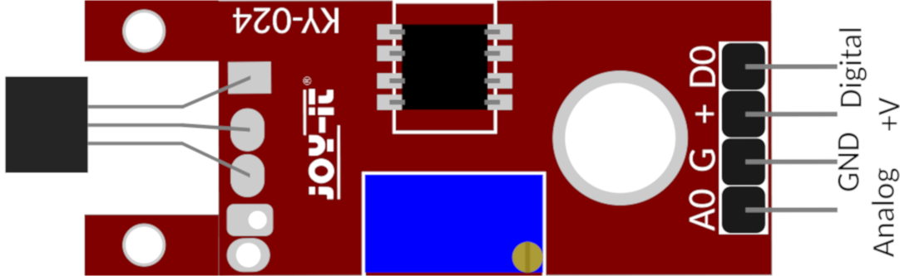
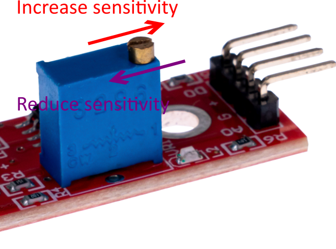
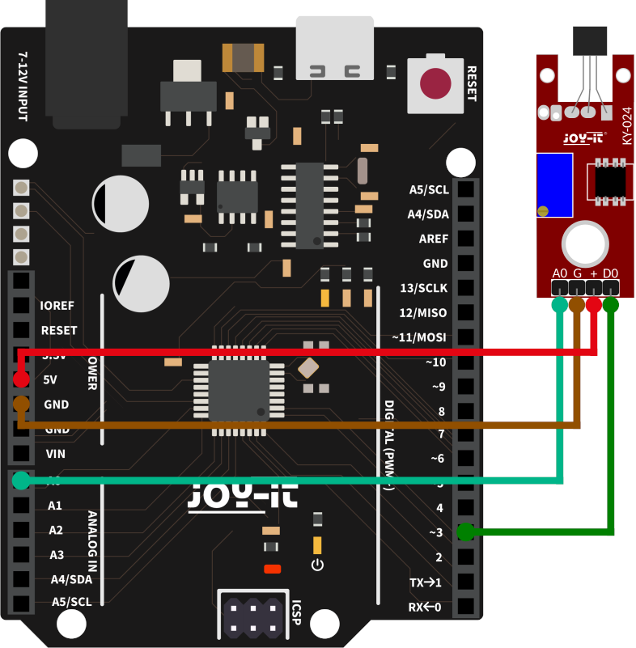

# KY-024 Linear magnetic Hall sensor - SS49E

- Il sensore KY-024 fornisce due output: uno analogico e uno digitale. I datasheet di questo sensore sono piuttosto confusionari e non contengono dati tecnici: [scheda tecnica](./SEN-KY024LM_Datasheet_2021-02-23.pdf), [manuale](./KY-024.PDF).
    - 
- L'output analogico proviene dal chip SS49E:
    - permette la misurazione del campo magnetico lungo un solo asse
    - riesce a leggere valori di campo magnetico anche grandi, da $-150mT$ a $+150mT$, ma la precisione è piuttosto carente (se la lettura analogica di Arduino fornisce solo valori da 0 a 1024, allora la precisione massima è di $300mT/1024=3Gauss$)
    - i dati letti da Arduino con `analogRead` saranno invertiti rispetto al campo magnetico, ovvero valori più alti letti corrispondono a valori più bassi del campo magnetico
    - il datasheet del SS49E è [qui](./SS49E.PDF)
- L'output digitale proviene da un comparatore:
    - dice semplicemente se il campo magnetico ha superato uno specifico valore
    - tale valore è impostabile girando la vite
    - 

### [Progetto di esempio: magnetometro_esterno](./magnetometro_esterno.ino)

Queste sono le connessioni da fare se si usa un Arduino UNO. Se si usa un altro arduino (ad esempio il Nano 33 BLE) l'importante è collegare il pin analogico in uscita dal sensore ad un pin analogico di Arduino, altrimenti la lettura non potrà essere analogica.

[Nel manuale online](https://sensorkit.joy-it.net/en/sensors/ky-024) sono presenti più informazioni.
